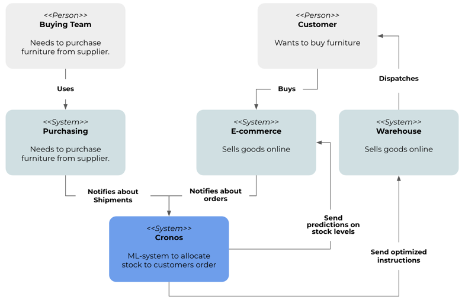

cronos
==============================
[](https://github.com/psf/black)


- [Origin](https://github.com/HeberTU/cronos)
- Authors: 
  - Heber Trujillo <heber.trj.urt@gmail.com>
  - Montserrat Navarro <montserrat.nvro.lpz@gmail.com> 
  - Juan José Nieto <juanjo.3ns@gmail.com>
- Date of last README.md update: 20.12.2022

## Project Overview

### Motivation

Our client is a successful furniture retailer. They source their furniture 
from manufacturers worldwide and sell it across Europe.

When their customers buy a sofa or a coffee table, we have to figure out how 
best to get those goods from Poland or China, or Vietnam into customers' 
living rooms.

At a high level, they have separate systems responsible for buying stock, 
selling stock to customers, and shipping goods to customers. Cronos is a 
machine learning system in the middle to coordinate the process by allocating 
stock to a customer's orders; see the following diagram: 



Until now, our Client has been presenting stock and lead times based on what 
is physically available in the warehouse. If the warehouse runs out of a 
product, the product is listed as "out of stock". This way, they are losing 
potential customers.

> Cronos system can keep track of all shipments, and when they're due to 
> arrive, we can treat the goods on those ships as part of our 
> Client's inventory, with slightly longer lead times. Fewer goods will appear 
> to be out of stock, our Client will sell more, and they can save money by 
> keeping lower inventory in the domestic warehouse.

## How to Run Scripts 

### Prerequisites

1. PyEnv
2. Poetry

#### PyEnv installation in macOS

In the terminal:

1. Update Homebrew and install it:
    ```zsh
   brew update
   brew install pyenv
    ```

2. Set up the shell environment for PyEnv for ZSH:
    ```zsh
   echo 'export PYENV_ROOT="$HOME/.pyenv"' >> ~/.zshrc
   echo 'command -v pyenv >/dev/null || export PATH="$PYENV_ROOT/bin:$PATH"' >> ~/.zshrc
   echo 'eval "$(pyenv init -)"' >> ~/.zshrc
    ```

3. Install python 3.8.6 using PyEnv
    ```zsh
   pyenv install 3.8.6
   pyenv global 3.8.6
    ```

#### Poetry installation

1. Install poetry using the following command:
    ```zsh
   curl -sSL https://raw.githubusercontent.com/python-poetry/poetry/master/get-poetry.py | python -
    ```

2. Add Poetry's bin directory to `PATH` environment variable.
    ```zsh
   source $HOME/.poetry/env
    ```

3. Set virtual env in project root. 
    ```zsh
   poetry config virtualenvs.in-project true
    ```


### Dependencies Installation 

1. Create python environment with all dependencies:
    ```zsh
    poetry install
    ```
   
2. Activate python environment:
    ```zsh
    source .venv/bin/activate
    ```
