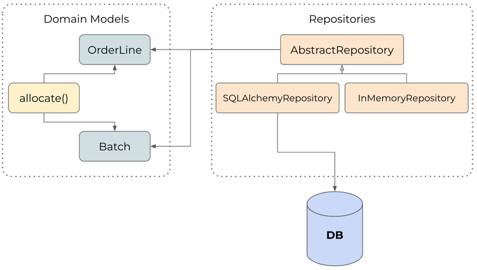

Repository Pattern
==============================

This library introduces all the necessary component to implement the repository 
pattern, a simplifying abstraction over data storage, allowing us to decouple 
our model layer from the data layer.

The following diagram shows the overview of how our Repository object sits 
between our domain model and the database:

